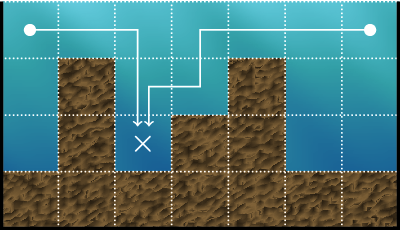

## [C. Where's My Water?](https://codeforces.com/contest/2207/problem/C)

## 题意

给定一个长度为 $n$ , 高度为 $h$ 的水槽， $i$ 位置存在淤泥，深度为 $a_i$

你可以安置排水管，每个排水管可以排出所有可以通过 向 下，左，右 移动不经过淤泥到排水管的水



问安置至多两个排水管最多有多少水被排出

It is guaranteed that the sum of $n$ over all test cases does not exceed $2000$.

## 题解

显然有 $\Omicron (n)$ 实现在位置 $x$ 安置一个排水管，$(1 - x)$ / $(x - n)$ 位置排出的水的数量（$n$ 较小，为了方便采用 $\Omicron (n^2)$ 的做法）

那么只需要枚举 $i, j$ 位置放排水管，计算 $(i + 1) - (j - 1)$ 排出的水

考虑均摊 $\Omicron (n)$ 解决，维护一个单峰的序列，对于新加入的位置 $a_j$ ,将序列中所有 $a_x < a_j$ 的全部弹出，直到到达峰顶

计算贡献，每个 $a_i$ 的贡献为 $w \times \min (a_i, a_{last})$，另外再维护峰顶的贡献即可

但是我场上错误的认为 贡献是 $w \times a_{back0}$ ，之前想到了 $w \times \min (a_{back0}, a_{back1})$ 但是否掉了，结束也没看出来 [提交记录](https://codeforces.com/contest/2207/submission/365902213)

[最终提交](https://codeforces.com/contest/2207/submission/365906338)

```cpp collapse={1-77}
#include <bits/stdc++.h>
using namespace std;
using ll = long long;
const int N = 2000 + 5;
int n, h;
int a[N];
ll pre[N][2];
void solve() {
    ll ans = 0;
    cin >> n >> h;
    for(int i = 1; i <= n; i++) cin >> a[i];
    for(int i = 1; i <= n; i++) {
        int l = i, r = i;

        int t = a[l];
        ll res = 0;
        for(int j = l - 1; j >= 1; j--) t = max(t, a[j]), res += h - t;
        pre[i][0] = res;

        t = a[r];
        res = 0;
        for(int j = r + 1; j <= n; j++) t = max(t, a[j]), res += h - t;
        pre[i][1] = res;
    }

    for(int i = 1; i <= n; i++) {
        ans = max(ans, pre[i][0] + pre[i][1] + h - a[i]);
    }

    deque<int> q;
    auto calc = [](int x, int y) -> ll {
        if(a[x] < a[y]) return 1ll * (y - x) * (h - a[x]);
        return 1ll * (y - x) * (h - a[y]);
    };

    for(int i = 1; i + 1 <= n; i++) {
        while(!q.empty()) q.pop_back();

        ll res = h - a[i];
        q.push_back(i);
        int fin = i;

        for(int j = i + 1; j <= n; j++) {

            while(!q.empty() && a[q.back()] < a[j]) {
                if(q.back() == fin) break;
                int back0 = q.back();
                q.pop_back();
                int back1 = q.back();
                res -= calc(back1, back0);
            }

            int back0 = j;
            int back1 = q.back();
            if(back1 == fin && a[back0] >= a[back1]) {
                res -= h - a[fin];
                fin = back0;
                res += h - a[fin];
            }
            res += calc(back1, back0);

            q.push_back(back0);
            ll cur = pre[i][0] + pre[j][1] + res;
            ans = max(ans, cur);
        }
    }
    cout << ans << endl;
}
signed main() {
    ios::sync_with_stdio(false);
    cin.tie(nullptr), cout.tie(nullptr);
    // freopen("A.in", "r", stdin);
    // freopen("A.out", "w", stdout);
    int T = 1;
    cin >> T;
    while(T--) solve();
}
```

## 解法1

但是有更加简单的做法：

与之前解法相同，$\Omicron (n^2)$ 可以得到 在 $i$ 位置放一个排水管，得到 $(x - i)$ / $(i - y)$ 排出的水

那么枚举中间点 $m$ ，可以 $O(n^2)$ 枚举 **水管位置** 和 **右端点** 维护 $(1-m)$ 排出水量的最大值，同理得到 $m - n$ 的最大值

$\max \left\{ max_{1-m} + max_{(m + 1)-n} \right\}$ 就是答案

[提交记录](https://codeforces.com/contest/2207/submission/365990769)

```cpp collapse={1-54}
#include <bits/stdc++.h>
using namespace std;
using ll = long long;
const int N = 2000 + 5;
int n, h;
int a[N];
ll f[N][2];
void solve() {
    cin >> n >> h;
    for(int i = 1; i <= n; i++) cin >> a[i];
    for(int i = 1; i <= n; i++) f[i][0] = f[i][1] = 0;
    for(int i = 1; i <= n; i++) {
        int t = a[i];
        ll res = h - t;
        for(int j = i - 1; j >= 1; j--) t = max(t, a[j]), res += h - t;
        f[i][0] = max(f[i][0], res);

        t = a[i];
        for(int j = i + 1; j <= n; j++) {
            t = max(t, a[j]), res += h - t;
            f[j][0] = max(f[j][0], res);
        }
    }

    for(int i = 1; i <= n; i++) {
        int t = a[i];
        ll res = h - t;
        for(int j = i + 1; j <= n; j++) t = max(t, a[j]), res += h - t;
        f[i][1] = max(f[i][1], res);

        t = a[i];
        for(int j = i - 1; j >= 1; j--) {
            t = max(t, a[j]), res += h - t;
            f[j][1] = max(f[j][1], res);
        }
    }

    // for(int i = 1; i <= n; i++) cout << f[i][0] << " \n"[i == n];
    // for(int i = 1; i <= n; i++) cout << f[i][1] << " \n"[i == n];

    ll ans = max(f[n][0], f[1][1]);
    for(int i = 1; i + 1 <= n; i++) ans = max(ans, f[i][0] + f[i + 1][1]);
    cout << ans << endl;
    
}
int main() {
    ios::sync_with_stdio(false);
    cin.tie(nullptr), cout.tie(nullptr);
    // freopen("A.in", "r", stdin);
    // freopen("A.out", "w", stdout);
    int T = 1;
    cin >> T;
    while(T--) solve();
}
```

## 解法2

但是有更加简单的做法：

依然考虑枚举 排水管的两个位置 $i, j$，**notice that** 重复的部分 恰好是最高位置 $\argmax \left\{ a_i, a_{i + 1}, \cdots , a_j \right\}$ 的 贡献 ，不过显然不是我 notice 到的（）

对于位置 $(x, y)$ 的水，它被统计两次时有： $\max \left\{ a_x, a_{x + 1}, \cdots , a_i \right\}, \max \left\{ a_x, a_{x + 1}, \cdots , a_j \right\} < y$

1. 对于 $i \leq x \leq j$ ，等价于 $\max \left\{ a_i, \cdots, a_j \right\} < y$
2. 对于 $x < i$ 或 $x > j$，等价于 $\max \left\{ a_x, \cdots, a_i \right\}, \max \left\{ a_i, \cdots, a_j \right\} < y$

令 $k = \argmax \max \left\{ a_i, \cdots, a_j \right\}$ ，发现情况 $1, 2$ 均等价于 排水的定义

故答案为 $x$ 排水 + $y$ 排水 - $k$ 排水

每次 $O(n)$ 维护 max_k 即可

[提交记录](https://codeforces.com/contest/2207/submission/365991753)

```cpp collapse={1-41}
#include <bits/stdc++.h>
using namespace std;
using ll = long long;
const int N = 2000 + 5;
int n, h;
int a[N];
ll f[N];
void solve() {
    cin >> n >> h;
    for(int i = 1; i <= n; i++) cin >> a[i];
    for(int i = 1; i <= n; i++) {
        int t = a[i];
        ll res = h - t;
        for(int j = i - 1; j >= 1; j--) t = max(t, a[j]), res += h - t;

        t = a[i];
        for(int j = i + 1; j <= n; j++) t = max(t, a[j]), res += h - t;
        f[i] = res;
    }

    ll ans = 0;
    for(int i = 1; i <= n; i++) ans = max(ans, f[i]);

    for(int i = 1; i <= n; i++) {
        int maxi = i;
        for(int j = i; j <= n; j++) {
            if(a[maxi] < a[j]) maxi = j;
            ans = max(ans, f[i] + f[j] - f[maxi]);
        }
    }
    cout << ans << endl;
}
int main() {
    ios::sync_with_stdio(false);
    cin.tie(nullptr), cout.tie(nullptr);
    // freopen("A.in", "r", stdin);
    // freopen("A.out", "w", stdout);
    int T = 1;
    cin >> T;
    while(T--) solve();
}
```