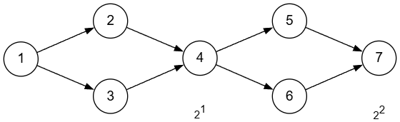
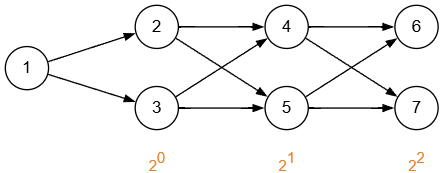
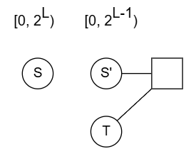

## 核心思想：基础图 + 调节器

无论是哪种定值构造方法，本质都是通过构造对数级别的基底，然后通过调节器使用类似二进制或斐波那契的拆分方法来构造出目标定值。

---

## 一、二进制拆分法

### 1. 原理简述

通过观察价值函数，构造形如 $f_i = 2 \times f_{i - 1}$ 的基础图，得到 $f_i = 2^i$。对所需的定值进行二进制拆分，最后通过调节器来实现定值的构造。

### 2. 习题

#### [Codeforces 388B - Fox and Minimal path](https://codeforces.com/problemset/problem/388/B)

:::note[题意]
给定一个整数 $K$（$1 \leq K \leq 10^9$），构造一个无向图，使得从起点到终点恰好有 $K$ 条长度相同的路径。
:::

:::tip[题解]
不难想到使用菱形的形式构造，使得到达单点有 $2^n$ 条相同长度的路径。然后在后面分别拼接上定长的路径，使得到达终点路径长度均相同，最后对 $K$ 进行二进制拆分即可。

:::

:::tip[优化：如何使得 $n$ 最小？]
基础的菱形形式依然有些浪费，考虑如下形式优化基础图：

后面拼接的定长路径也可以复用 $\log_2 V$ 长度的链。通过这种复用，最小的 $n$ 可以做到 $3 \lfloor {\log_2 {V}} \rfloor$ 级别。

参考提交：[https://codeforces.com/contest/388/submission/387215801](https://codeforces.com/contest/388/submission/387215801)
:::

#### [AtCoder ABC 108 D - All Your Paths are Different Lengths](https://atcoder.jp/contests/abc108/tasks/arc102_b)

:::note[题意]
构造一个带权有向图，使得从 $1$ 到 $N$ 恰好有 $L$ 条不同的路径，且长度是 $0$ 到 $L - 1$ 的整数。

$$
n \leq 20, m \leq 60, 2 \leq L \leq 10^6
$$
:::

:::tip[题解]
假设我们已经有从 $S'$ 到 $T$ 权值在 $[0, 2^{L - 1})$ 范围内的路径，尝试将 $S$ 与 $S'$ 连接起来，构造出从 $S$ 到 $T$ 的 $[0, 2^L)$ 路径。

经过尝试可以发现，分别连权值为 $0$ 和 $2^{L - 1}$ 的边即可完成转移。

以此类推，点数为 $2 + \lfloor {\log_2 L} \rfloor = 2 + 19 = 21$。多连几条边优化掉其中一个点即可满足题意。

参考提交：[https://atcoder.jp/contests/abc108/submissions/78452048](https://atcoder.jp/contests/abc108/submissions/78452048)
:::

---

## 二、斐波那契拆分法

### 1. 原理简述

构造 $F_i = F_{i-1} + F_{i-2}$ 形式的斐波那契数列，通过倒序贪心的方式对所需的定值进行拆分。

### 2. 正确性证明 (Zeckendorf's theorem)

:::tip[Zeckendorf's theorem]
任何正整数 $N$ 都可以唯一表示为若干个互不相邻的斐波那契数之和：

$$
N = \sum_{i=1}^k F_{c_i} \quad (c_1 \ge 1, \; c_{i+1} \ge c_i + 2)
$$

**1. 存在性证明**
* 存在 $k$ 使得 $F_k \leq N < F_{k+1}$，我们选定 $F_k$。
* 因为 $N < F_{k + 1} = F_k + F_{k - 1}$，所以有：
  $$
  N' = N - F_k < F_{k - 1}
  $$
这保证了对 $N'$ 继续贪心分解时，其选定的下一项斐波那契数必定小于 $F_{k-1}$，天然满足不相邻的条件。

**2. 唯一性证明**
* **引理**：由不大于 $F_n$ 且互不相邻的斐波那契数列构成的子集和，严格小于 $F_{n + 1}$。
  $$
  \sum_{i \leq n} F_{c_i} \leq F_n + F_{n - 2} + F_{n - 4} + \cdots + F_1 = F_{n + 1} - 1 < F_{n + 1}
  $$
* **反证法**：假设存在两种不同的 $N$ 分解方式，找出最大的且在两个集合中存在性不同的斐波那契数，记为 $F_k$。不妨设 $F_k \in A$ 且 $F_k \notin B$。
* 删掉两个集合中大于 $F_k$ 的公共部分后，剩余部分的值记为 $N'$。
* 此时 $N'$ 的两种分解方式为：$N' = F_k + \sum_{F_i \in A, i<k} F_i$ 以及 $N' = \sum_{F_i \in B, i<k} F_i$。
* 根据引理，集合 $B$ 中所有小于 $F_k$ 且不相邻的斐波那契数之和严格小于 $F_k$：
  $$
  N' = \sum_{F_i \in B, i<k} F_i < F_k
  $$
* 但在集合 $A$ 中，$N'$ 至少包含了 $F_k$，即 $N' \geq F_k$，这就得出了矛盾。故分解方式必然唯一。
:::

### 3. 习题

#### [2026牛客多校9A](https://ac.nowcoder.com/acm/contest/133884/A)

:::note[题意]
记 $P_1 = 1, P_v = \sum_{u \rightarrow v} P_u$。

要求构造一个简单无向图，使得 $\sum_{u \rightarrow v} (P_u + P_v) = K$。

$$
n \leq 200, m \leq 300, K \leq 10^{18}
$$
:::

:::tip[题解]

由于为简单图，连边形式应为 $(i - 2) - i, (i - 1) - i$。

尝试此种连边方式：

* 基础图 $1, \cdots, b$ 之间连接 $(i - 2) - i, (i - 1) - i$，则有 $P_i = F_i$。

* 记基础图贡献为 $C_b$，则：
$$
C_b - C_{b - 1} = 2 P_b + P_{b - 1} + P_{b - 2} = 3 P_b
$$

**考虑如何调节：**

* 在节点 $i$ 下挂一个节点的贡献为 $2 F_i$，不能改变奇偶性。

* 发现最小可以通过新增点连接基础点 $2, 3$ 得到 $9$ 的贡献来调节奇偶性。

**最终可以得到：**

* 找到最大的 $b$ 使得 $C_b \leq K$，对于余数为奇数，先减 $9$，剩余偶数除以 $2$，由 Zeckendorf's theorem 一定可以分解。

* 倘若余数为奇数且小于 $9$，$b := b - 1$ 即可，所需贡献的增长仅为 $3 P_b$，由于没有互不相邻的要求，任意贪心构造定然有解。
:::

---

## 选择建议

* 对于点数较少的题目，建议使用二进制拆分法。

* 若有要求为简单图，且点数较多，建议使用斐波那契拆分法。

当然还是看题目价值函数来做最好。