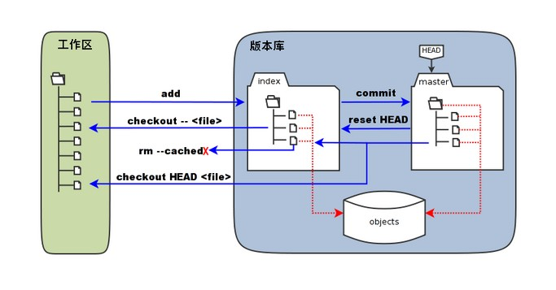

## Git 基础概念

### Git 工作区、暂存区与本地仓库



- 工作区：电脑中看到的目录
- 暂存区（stage / index）：Git 用来临时存放即将提交的文件快照的区域
- 本地仓库：存储项目的所有版本历史记录的数据库

### HEAD 与 Branch ref

1. HEAD 是一个代表当前位置的指针
2. Branch ref 是指向某个具体提交对象（commit object）的指针，代表分支的位置

#### HEAD 与 Branch ref 两种关系

1. HEAD -> Branch ref：表示当前在某个分支上工作
2. HEAD -> Commit object：表示处于“分离头指针”状态

#### 辨析移动 HEAD 和 Branch ref

1. 仅移动 HEAD（游离状态）
切换视图，不改变任何分支指针：
- `git checkout <commit/tag>` / `git switch --detach`：HEAD 指向指定提交，进入游离 HEAD 状态
- `git checkout/switch <branch>`：HEAD 切换至另一分支（正常分支切换）

2. 移动当前分支指针（HEAD 随动）
在 HEAD 指向分支时，以下操作会推动该分支前进或回退：
- `git commit`：分支指针前移至新提交
- `git reset <commit>`：强制回退分支指针
- `git merge` / `git rebase` / `git pull`：分支指针前移以整合新提交
- `git branch -f <name> <commit>`：强制移动非当前分支的指针
- `git fetch`：更新远程追踪分支（如 `origin/main`），不改变本地分支与 HEAD

### 远程仓库（Remote Repository）

- origin/main：远程仓库在本地的只读快照

### 相对引用

> [!TIP]
> 对与 Branch Ref , HEAD 以及 Commit Hash 都可以使用

- `~` 是垂直选择
- `^` 是水平选择（多父级/合并节点）

> `HEAD` \ `HEAD~0` 当前版本
>
> `HEAD^` \ `HEAD~1` 上一个版本
>
> `HEAD^^` \ `HEAD~2` 上上一个版本
>
> `HEAD^n` 适用于多个 parent 的提交，表示第n个 parent 提交（默认值为 1 即父亲的序列号是从 1 开始的）
>
> `^n` 与 `~n` 支持嵌套，例如 `HEAD~2^1` 表示 HEAD 的上上个提交的第一个 parent 提交

## 常见场景（用到的时候再补）

### 初始化或克隆仓库

```bash
git init                # 初始化一个新的 Git 仓库
git clone <repo_url>    # 克隆一个远程仓库到本地
```

### 查看状态与日志

```bash
git status              # 查看当前工作区和暂存区的状态
git log                 # 查看提交历史日志
```

### 添加文件到暂存区

```bash
git add <file>          # 添加指定文件到暂存区
git add .               # 添加当前目录下的所有文件到暂存区
```

### 提交更改

```bash
git commit -m "Commit message"   # 提交暂存区的更改并添加提交信息
git commit --amend               # 修改上一次提交
```

### 分支操作

```bash
git branch                      # 列出所有分支
git branch <branch-name>        # 创建新分支
git checkout <branch-name>      # 切换到指定分支
git branch -d <branch-name>     # 删除分支
git merge <branch-name>         # 合并指定分支到当前分支
```

### 远程仓库操作

```bash
git remote -v                # 查看远程仓库信息
```

```bash
git fetch <remote>            # 从远程仓库获取最新更改
git push <remote> <branch>     # 推送本地分支到远程仓库
git push -u <remote> <branch>  # 推送并设置上游分支
git pull <remote> <branch>     # 从远程仓库拉取并合并分支
```

### 查看历史提交

```bash
git log                       # 查看提交历史
git log --oneline             # 简洁模式查看提交历史
git log --graph               # 图形化查看提交历史
```

### 版本回退

```bash
git reset --hard <commit-hash>    # 回退到指定提交，丢弃之后的所有更改
```

### 工作流

```bash
# 1. 克隆或初始化仓库
git clone <仓库URL> 或 git init

# 2. 创建开发分支
git checkout -b feature/new-feature

# 3. 开发并提交
git add .
git commit -m "实现新功能"

# 4. 推送到远程
git push origin feature/new-feature

# 5. 合并到主分支
git checkout main
git pull origin main
git merge feature/new-feature
git push origin main
```

### 解决远程冲突

```bash
git fetch                 # 获取远程更新
git rebase origin/main    # 变基到最新的 main 分支
git push                  # 推送变基后的提交
# 或者
# 普通的 pull 会产生一个 merge commit
git pull --rebase         # 拉取并变基
git push                  # 推送变基后的提交
```
